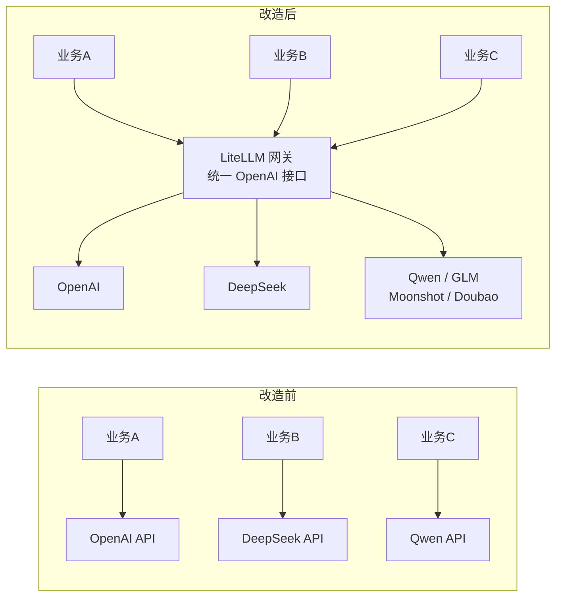
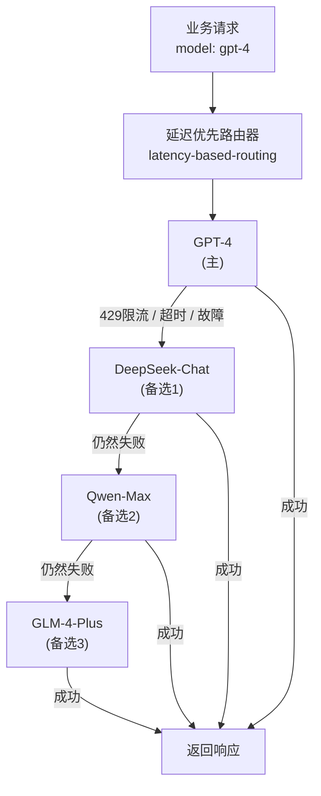
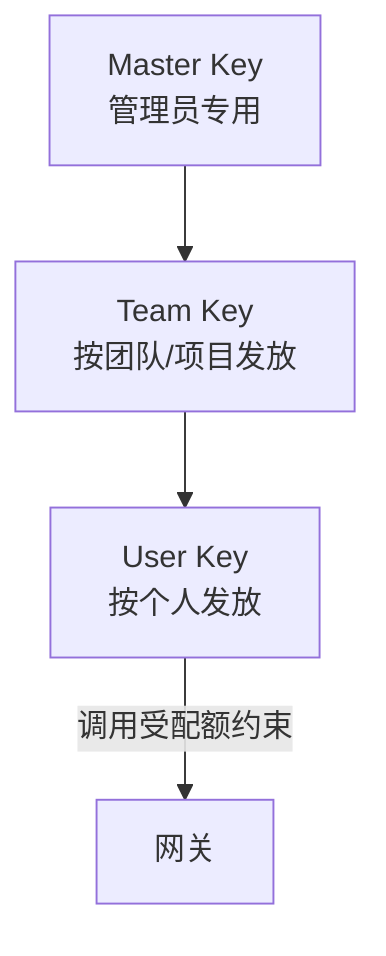

# LiteLLM 企业级 LLM API 网关——架构汇报

---

## 一、背景与痛点

随着公司业务对大模型的依赖日益加深，我们面临以下核心问题：

- **多厂商碎片化**：团队同时使用 OpenAI、DeepSeek、阿里云、智谱等多家服务，每家 SDK 和 API 规范不同，业务代码耦合严重
- **成本不透明**：各团队直接调用厂商 API，无法统一监控和管控 Token 消耗与费用
- **可用性无保障**：单一模型限流或故障时，无降级机制，直接影响业务
- **权限管理缺失**：API Key 散落各处，无法按团队、项目进行精细化授权

---

## 二、解决方案：LiteLLM 统一网关

我们选型并落地了 **LiteLLM Proxy**，作为全公司大模型访问的统一入口层。

### 核心定位



---

## 三、五大核心功能优势

### 优势一：统一接口，零迁移成本

LiteLLM 对外 100% 兼容 OpenAI API 规范，业务代码**只需修改一个参数**即可接入：

```python
# 改造前：直连 OpenAI
client = OpenAI(api_key="sk-openai-xxx")

# 改造后：指向网关，其余不变
client = OpenAI(
    base_url="http://gateway:4000/v1",
    api_key="sk-litellm-team-key"
)
```

无论底层调用哪家模型，业务代码逻辑**完全不变**，极大降低迁移阻力。

---

### 优势二：多模型接入，灵活调度

当前已接入 **6 家厂商、24 个模型**，覆盖能力如下：

| 能力维度 | 可选模型 |
|---|---|
| 旗舰推理 | GPT-4o、DeepSeek-R1、Qwen-Max、GLM-4-Plus |
| 快速响应 | GPT-4o-mini、Qwen-Turbo、GLM-4-Flash、Doubao-Lite |
| 代码生成 | DeepSeek-Coder |
| 超长上下文 | Moonshot-128K |
| 图像理解 | GPT-4o-Vision、Qwen-VL-Max、GLM-4V |
| 本地私有化 | Ollama（预留接口，可按需启用） |

新增模型只需在配置文件追加几行，**无需改动任何业务代码**。

---

### 优势三：智能路由与高可用保障

这是最核心的工程价值所在——**自动容灾，业务无感知**。



**关键参数：**

- 路由策略：`latency-based-routing`（延迟优先）
- 最多重试 **3 次**，间隔 5 秒
- 单次请求超时 **120 秒**
- 模型连续失败后**冷却 60 秒**，避免持续打压限流中的服务
- 每个主流模型均配置了 3 级回退链

这意味着即便 OpenAI 出现区域性故障，业务侧感知到的只是轻微延迟增加，而非服务中断。

---

### 优势四：精细化权限与成本管控

通过三层 Key 体系，实现"**谁在用、用了多少、花了多少**"全链路可见：



- 每个 Key 可独立设置**月度预算上限**（超出自动拒绝）
- 支持设置 **RPM（每分钟请求数）/ TPM（每分钟 Token 数）** 双维度限流
- Admin UI 可实时查看各 Key 的消耗明细、剩余预算

**实际效果**：彻底告别月底账单超支，每个团队的 AI 成本清晰可查、可控可限。

---

### 优势五：完整的审计与可观测性

所有请求均持久化记录至 PostgreSQL，可查询：

- 请求时间、调用模型、响应延迟
- Input/Output Token 消耗与折算费用
- 调用来源（哪个 Key、哪个用户、哪个团队）
- 失败请求与错误类型

同时提供 **Admin UI 可视化看板**，无需写 SQL 即可完成日常管理。

---

## 四、交付成果清单

| 类别 | 内容 |
|---|---|
| **基础设施** | Docker Compose 一键部署，包含网关 + 数据库 |
| **模型接入** | 6 家厂商 24 个模型，含视觉模型与推理模型 |
| **路由配置** | 延迟优先路由 + 11 条回退链 + 冷却机制 |
| **运维脚本** | 数据库自动备份（保留 30 天）+ 一键恢复脚本 |
| **文档体系** | 9 篇完整文档，覆盖部署、配置、运维、使用全链路 |
| **安全规范** | 敏感信息环境变量隔离，Key 管理规范已制定 |

---

## 五、价值总结

| 维度 | 改造前 | 改造后 |
|---|---|---|
| 接入新模型 | 各业务方各自对接，周级工作量 | 网关配置追加，分钟级完成 |
| 服务可用性 | 单点依赖，故障即中断 | 自动回退，业务无感知 |
| 成本可见性 | 月底账单才知道花了多少 | 实时监控，按团队可视 |
| 权限管控 | API Key 裸露，无法细粒度控制 | 三级 Key 体系，按需授权 |
| 合规审计 | 无日志，无法溯源 | 全量请求记录，可随时审查 |

> **一句话总结**：LiteLLM 网关让大模型的使用从"各自为战、野蛮生长"升级为"统一管理、可控可观"，为公司 AI 能力的规模化落地打下了坚实基础。
