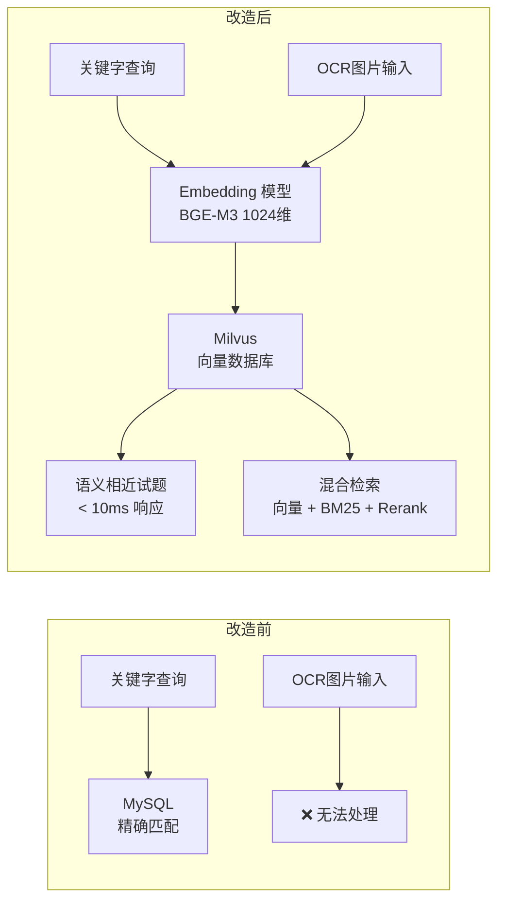

# Milvus 企业级向量数据库——架构汇报

---

## 一、背景与痛点

随着 AI 应用对语义理解能力的依赖日益加深，我们在试题匹配场景中面临以下核心瓶颈：

- **传统检索失效**：MySQL 等关系型数据库只能精确匹配关键字，无法处理"语义相近但表述不同"的检索诉求
- **OCR 场景无解**：试题以图片形式存在时，关键字方案彻底失效，必须依赖向量语义检索
- **原型工具受限**：Chroma 适合开发验证，但不具备生产级稳定性、水平扩展能力与完整 CRUD 支持
- **工程管线缺失**：缺乏从 Embedding → 入库 → 检索 → 评估的标准化工程流程

---

## 二、解决方案：Milvus 向量数据库

我们选型并落地了 **Milvus v2.6.10 Standalone**，作为试题语义匹配系统的核心存储与检索引擎，整体演进路线为 Chroma（开发验证）→ Milvus（生产落地）。

### 核心定位



---

## 三、六大核心功能优势

### 优势一：专为向量检索设计，性能远超传统方案

传统关系型数据库无法进行相似度检索，Milvus 原生支持 ANN（近似最近邻）检索，采用 HNSW 索引，在百万量级数据下毫秒级返回语义相近结果。

**本项目实测数据**：检索 1024 维 BGE-M3 向量，查询延迟稳定控制在 **10ms 以内**。

---

### 优势二：多索引类型，覆盖全规模场景

无需更换方案，通过参数切换即可适配不同数据规模：

| 索引类型 | 适用规模 | 内存占用 | 查询速度 | 精度 | 本项目状态 |
|---------|---------|---------|---------|------|---------|
| HNSW | 中小规模（< 百万） | 较大 | 快 | 高 | 已采用 |
| IVF_FLAT | 中等规模 | 中等 | 中 | 高 | 备选 |
| IVF_PQ | 大规模（> 千万） | 小 | 快 | 略低 | 扩展备选 |

一套代码，通过参数切换索引策略，**业务逻辑完全不变**。

---

### 优势三：向量检索与标量过滤协同执行

支持在语义检索的同时叠加精确字段过滤，这是 Elasticsearch、Faiss 等方案难以优雅实现的核心能力：

```python
# 检索"数学"科目下语义最相近的试题，一次调用同时完成两种过滤
results = milvus_manager.search(
    query_embedding=embedding,
    top_k=5,
    subject_filter="数学",  # 向量相似度 + 标量精确过滤，同步执行
)
# 等效逻辑：subject == "数学" AND cosine_similarity(embedding, query) > 0.7
```

本项目通过 `subject` 字段标量索引加速科目维度过滤，**无需两次查询，无需后处理筛选**。

---

### 优势四：原生幂等 upsert，完美支持增量更新

Milvus 2.x 提供原生 `upsert` 接口，"有则更新、无则插入"，完美契合试题库持续更新的业务场景：

```python
# 新增或更新试题，调用方无需判断记录是否已存在
milvus_manager.upsert(data_list)  # 幂等操作，可安全重复调用
```

告别手动 `SELECT → INSERT/UPDATE` 的冗余逻辑，**业务代码复杂度大幅降低**。

---

### 优势五：三种部署模式，覆盖开发到生产全周期

同一套 `pymilvus` API，切换一个参数即可在三种模式间无缝迁移：

| 模式 | 连接方式 | 适用场景 | 核心优点 |
|------|---------|---------|------|
| Milvus Lite（嵌入式） | `uri="./milvus_data.db"` | 本地开发、单元测试 | 零依赖，无需启动任何服务 |
| Standalone（Docker） | `uri="http://localhost:19530"` | 单机生产环境 | 完整功能，数据持久化 |
| Cluster（分布式） | `uri="http://host:19530"` | 超大规模生产 | 水平扩展，支持 PB 级数据 |

从开发环境升级至生产环境，**代码零改动**。

---

### 优势六：生态完整，与主流 AI 框架原生集成

- **LlamaIndex**：通过 `MilvusVectorStore` 接入，5 行代码完成完整 RAG 检索链路
- **LangChain**：官方 VectorStore 原生支持，开箱即用
- **HuggingFace**：Embedding 模型直接对接，无需额外适配层
- **Attu Web UI**：可视化管理控制台，支持 Collection 浏览、数据查询、索引监控

---

## 四、交付成果清单

| 类别 | 内容 |
|---|---|
| **基础设施** | Docker Compose 一键部署，Milvus Standalone + Attu 管理界面 |
| **向量工程管线** | 数据清洗 → BGE-M3 Embedding → Milvus 入库 → 混合检索 → Rerank 完整链路 |
| **检索策略** | 向量检索 + BM25 稀疏检索 + RRF 融合排序 + Cross-Encoder Rerank |
| **Schema 设计** | 启用动态字段，支持零改造扩展新属性；科目字段标量索引已建立 |
| **数据迁移** | `milvus_migration.py` 已验证 Chroma → Milvus 完整迁移路径 |
| **升级路径** | Standalone → Cluster 平滑升级，业务代码无需重构 |

---

## 五、价值总结

| 维度 | 改造前 | 改造后 |
|---|---|---|
| 检索方式 | 关键字精确匹配，表述不同即漏检 | 语义相似度检索，跨表述命中 |
| OCR 场景 | 完全无法处理图片题目 | 直接检索，与文字题目同等支持 |
| 数据规模上限 | 受限于 MySQL 全表扫描性能 | 百万量级 < 10ms，千万级可水平扩展 |
| 数据更新 | 手动判断插入或更新，逻辑复杂 | 原生幂等 upsert，安全重复调用 |
| 部署迁移成本 | 切换方案需重构代码 | 修改一行 uri 参数，零代码改动 |
| 可观测性 | 无管理界面，运维全靠命令行 | Attu UI 实时监控，索引与数据可视化 |

> **一句话总结**：Milvus 将试题匹配从"关键字对齐"升级为"语义理解"，为 AI 能力在教育场景的规模化落地提供了坚实的检索基础设施。
