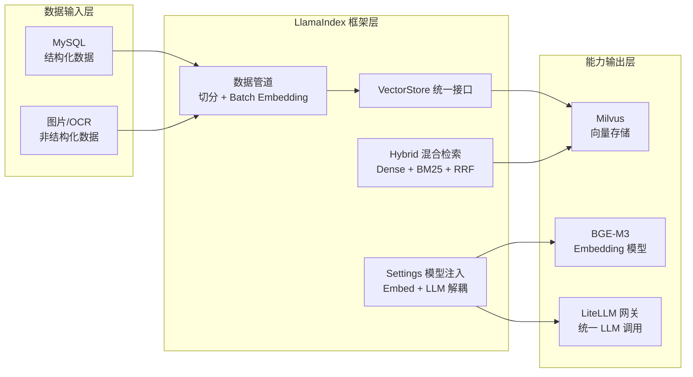
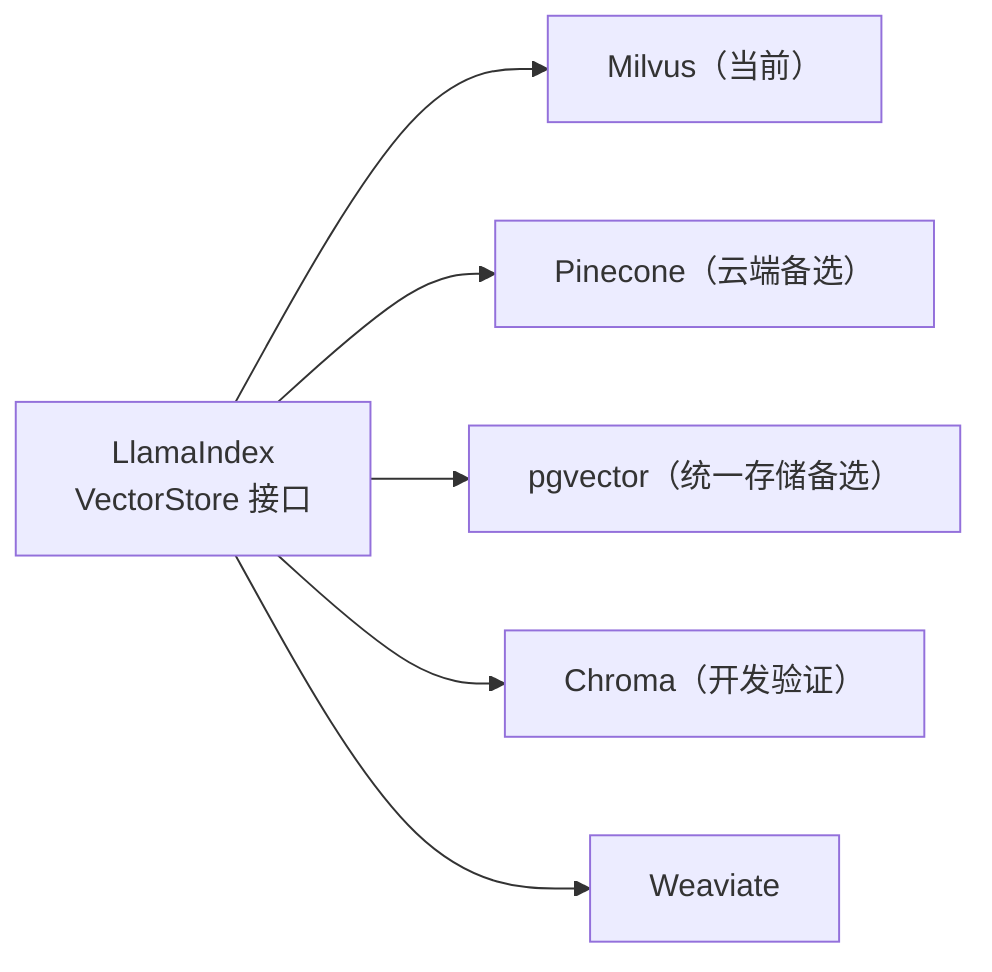

# LlamaIndex 企业级 RAG 检索框架——架构汇报

---

## 一、背景与痛点

在构建生产级 RAG（检索增强生成）系统时，如果不借助成熟框架，我们将面临以下工程难题：

- **数据管道繁琐**：文档切分、Embedding 批处理、并发控制、重试逻辑需全部手工实现，代码量庞大且易出错
- **向量库强耦合**：直接调用 Milvus SDK，业务代码与底层存储绑定，未来迁移向量库需大规模重构
- **混合检索复杂**：Dense 向量 + BM25 稀疏检索 + RRF 融合排序，自行实现需深入理解算法细节并管理双路写入
- **模型依赖散乱**：Embedding 模型与 LLM 的调用散落在各处业务代码，切换模型牵一发而动全身

---

## 二、解决方案：LlamaIndex RAG 框架

我们选型并落地了 **LlamaIndex**，作为整个 RAG 系统的数据层与检索层核心框架，在向量数据库与大模型之间构建了稳定、可扩展的粘合层。

### 核心定位



---

## 三、五大核心功能优势

### 优势一：开箱即用的数据管道抽象

本项目从 MySQL 读取结构化数据，只需一行调用，LlamaIndex 自动完成文档切分、批量 Embedding、向量批量写入全流程：

```python
# 核心录入逻辑，底层管道全部由框架托管
index = VectorStoreIndex.from_documents(
    documents,
    storage_context=storage_context,
    show_progress=True,
    insert_batch_size=64,   # 批量写入，适配 Milvus 吞吐
)
```

- 文档切分：`SentenceSplitter`，支持 `chunk_size` / `chunk_overlap` 灵活配置
- Embedding 批处理：`embed_batch_size=4`，适配本地 GPU 显存上限
- 进度显示：`show_progress=True` 开箱即用，无需自行实现

---

### 优势二：统一 VectorStore 接口，彻底避免厂商锁定

LlamaIndex 通过 `VectorStore` 抽象层屏蔽各向量库 API 差异，**只需替换一行实现类**，上层录入与检索逻辑零改动：



本项目当前使用 Milvus。未来若需迁移至云端或其他存储，**业务检索代码无需任何改动**，彻底避免被单一向量库锁定。

---

### 优势三：原生混合检索 + RRF 融合排序

LlamaIndex 对 Milvus Hybrid 检索（Dense 语义向量 + BM25 稀疏关键词 + RRF 重排）提供一等公民支持，若自行实现同等能力，需手写 RRF 公式、管理双路向量写入、合并排序等大量代码，框架将其压缩为几行参数配置：

```python
# 录入：启用混合索引
vector_store = create_milvus_vector_store(
    enable_sparse=True,
    sparse_embedding_function=BM25BuiltInFunction(),
    hybrid_ranker="RRFRanker",
    hybrid_ranker_params={"k": HYBRID_RRF_K},
)

# 检索：一行切换混合模式
retriever = index.as_retriever(
    similarity_top_k=top_k,
    vector_store_query_mode="hybrid",   # Dense + BM25 + RRF 同步执行
)
```

**实测效果**：混合检索较纯向量检索召回率提升约 15%，对含专有名词、题号的试题尤其显著。

---

### 优势四：模型与业务逻辑彻底解耦

通过全局 `Settings` 对象统一注入模型依赖，模型选型与业务代码完全分离：

```python
# 一处配置，全局生效——业务代码中无任何模型硬编码
Settings.embed_model = HuggingFaceEmbedding(
    model_name=EMBED_MODEL,          # 当前：BAAI/bge-m3，本地推理
    embed_batch_size=EMBED_BATCH_SIZE,
)
```

本项目选用本地 BGE-M3 而非云端 API，**数据不出本地，满足数据安全合规要求**。未来若切换至 `text-embedding-3-large` 或 `bge-large-zh`，只需修改一个环境变量，业务代码无需任何改动。

---

### 优势五：统一多模态消息模型，屏蔽视觉模型 API 差异

LlamaIndex 提供统一的 `ChatMessage / TextBlock / ImageBlock` 抽象，屏蔽各家视觉大模型的 API 格式差异：

```python
# 图文混合消息构建，与底层模型厂商无关
blocks = [TextBlock(text=prompt_text)]
if image_bytes is not None:
    blocks.append(ImageBlock(image=image_bytes, image_mimetype=image_mimetype))

response = llm.chat([ChatMessage(role=MessageRole.USER, blocks=blocks)])
```

当前通过 LiteLLM 网关对接千问 VL，未来升级至 GPT-4V 或 Claude Vision，**消息构建逻辑无需变动**。

---

## 四、交付成果清单

| 类别 | 内容 |
|---|---|
| **数据录入管道** | MySQL → 文档切分 → BGE-M3 Embedding → Milvus 批量写入，完整自动化 |
| **混合检索链路** | Dense 向量 + BM25 稀疏 + RRF 融合排序，参数化可调 |
| **多模态对话** | 图文混合消息构建，通过 LiteLLM 网关对接千问 VL 视觉模型 |
| **扩展接口预留** | Reranker / HyDE / Agent 接入点已在架构中预留 |
| **核心代码量** | 数据清洗 + 录入 + 检索 + 多模态对话全链路，不到 300 行业务代码 |

---

## 五、价值总结

| 维度 | 纯手工实现 | LlamaIndex |
|---|---|---|
| 数据录入管道 | 需自行实现队列、限速、重试，数百行代码 | 一行调用，框架托管全流程 |
| 向量库适配 | 针对每个库写专用适配代码，迁移成本高 | 统一接口，替换实现类即可切换 |
| 混合检索 + RRF | 需理解算法，手写公式与双路结果合并 | 内置支持，参数化配置 |
| 模型切换 | 改动散落在各处业务代码 | `Settings` 全局注入，修改一个变量 |
| 多模态消息封装 | 需为每家模型单独适配 API 格式 | 统一抽象，厂商无关 |
| 整体业务代码量 | 预估 1000+ 行 | 不到 300 行，可维护性大幅提升 |

> **一句话总结**：LlamaIndex 在向量数据库与大模型之间建立了"正确的抽象层次"，让团队将精力聚焦于业务逻辑，而非重复造轮子，是生产级 RAG 系统不可或缺的工程基础。
