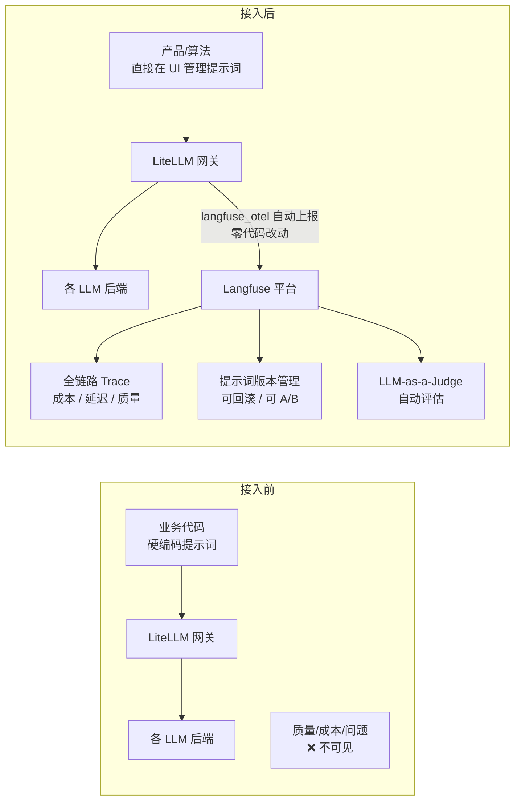
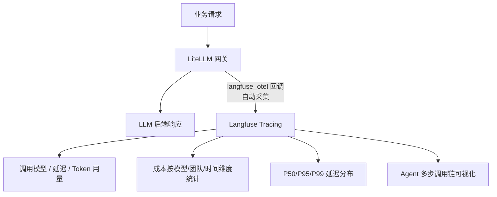
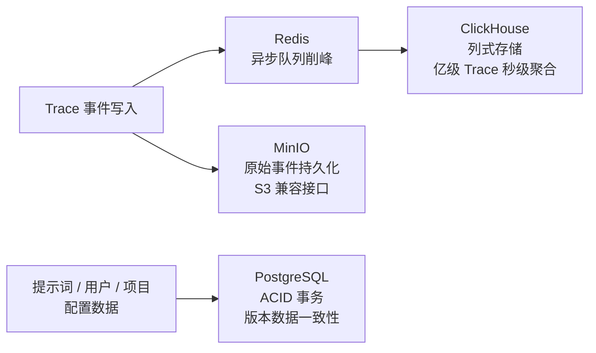

# Langfuse LLM 可观测性平台——架构汇报

---

## 一、背景与痛点

随着公司 AI 应用持续深化，LLM 调用规模快速增长，工程团队面临以下核心痛点：

- **提示词无法版本化管理**：迭代靠人工维护文档，每次修改都必须走代码发布流程，产品与算法同学无法独立操作
- **LLM 调用如黑盒**：出现质量问题难以定位，Token 成本无法按团队、按场景精细化统计
- **模型效果难以量化**：A/B 对比依赖人工经验，缺乏系统化实验与数据驱动的迭代手段
- **跨团队协作摩擦大**：产品/算法修改提示词必须依赖工程师介入，沟通成本高、发布周期长

---

## 二、解决方案：Langfuse 平台

我们选型并落地了 **Langfuse**（开源 LLM 可观测性与提示词管理平台），通过 Docker Compose 完成单机部署，与现有 LiteLLM 代理服务完成零代码对接。

### 核心定位

---

## 三、五大核心功能优势

### 优势一：提示词版本化管理，发布解耦工程

将提示词从代码中彻底剥离，实现"**内容与逻辑分离**"：

| 能力 | 说明 |
|------|------|
| 版本控制 | 每次修改自动创建新版本，完整历史可追溯，支持一键回滚 |
| 标签化发布 | 通过 `production` / `staging` 标签控制生效版本，**无需修改代码、无需重新部署** |
| 零延迟读取 | SDK 内置客户端缓存，提示词读取性能等同内存操作，不引入额外延迟 |
| 非研发协作 | 产品经理、算法同学可直接在 Web UI 修改发布，**完全解耦工程侧发布节奏** |
| Playground 调试 | 内置在线测试环境，直接调用 LiteLLM 后端验证效果，所见即所得 |

---

### 优势二：LLM 全链路可观测性，调用不再是黑盒

所有经过 LiteLLM 的调用**自动上报**，业务代码无需任何埋点改造：

---

### 优势三：质量评估体系，从经验驱动到数据驱动

建立提示词迭代的量化闭环：

| 能力 | 说明 |
|------|------|
| LLM-as-a-Judge | 配置评判规则后，自动对生产 Trace 进行 AI 裁判评分，无需人工逐条审阅 |
| 数据集管理 | 创建 Golden Dataset，对不同提示词版本、不同模型进行批量回归测试 |
| A/B 效果对比 | 同一数据集跑多个实验，量化对比各方案评分分布与通过率 |
| 人工标注队列 | Annotation Queue 支持多人协作打分，持续构建高质量标注数据 |

---

### 优势四：高性能分层存储架构，支撑大规模 Trace 分析

读写分离 + 列式分析，保证写入低延迟的同时支撑大规模数据的快速检索与统计。

---

### 优势五：完全开源自托管，数据主权完整

| 维度 | 说明 |
|------|------|
| 数据主权 | 所有 Trace 数据、提示词完全存储在本地，不流出外网，满足数据安全合规要求 |
| 零外部依赖 | Docker Compose 单机即可运行完整功能，无需购买 SaaS 订阅 |
| 可定制扩展 | 开源 MIT 协议，可二次开发对接内部权限体系、告警平台 |
| 云原生就绪 | 官方提供 Helm Chart，平滑迁移至 Kubernetes，支持水平扩展 |

---

## 四、交付成果清单

| 类别 | 内容 |
|---|---|
| **基础设施** | Docker Compose 一键部署，含 Langfuse + PostgreSQL + ClickHouse + Redis + MinIO |
| **LiteLLM 集成** | `langfuse_otel` 回调配置完成，所有 LLM 调用自动上报，零业务代码改动 |
| **Playground** | 已配置通过 LiteLLM 调用本地及云端模型，支持在线调试验证 |
| **提示词管理** | 版本控制 + 标签化发布流程已验证，非研发人员可独立操作 |
| **运维配置** | 完整健康检查与自动重启策略，服务异常自恢复 |

---

## 五、价值总结

| 维度 | 改造前 | 改造后 |
|---|---|---|
| 提示词发布 | 修改代码 → 走发布流程，天级周期 | Web UI 修改打标签，分钟级生效 |
| LLM 成本可见性 | 月底账单才知道，无法溯源到业务 | 实时按模型/团队/时间精细化统计 |
| 质量问题定位 | 日志排查，无完整上下文 | 全链路 Trace，端到端可视化还原 |
| 模型效果评估 | 依赖人工经验，无量化依据 | LLM-as-a-Judge + A/B 实验，数据驱动 |
| 跨团队协作 | 产品/算法改提示词必须找工程师 | 各角色独立操作，工程师从中解放 |

> **一句话总结**：Langfuse 以极低的接入成本，为 AI 工程体系补齐了「提示词管理」、「可观测性」、「质量评估」三大核心能力，让 LLM 应用从"凭感觉运营"升级为"有数据、可度量、能迭代"的工程化体系。
