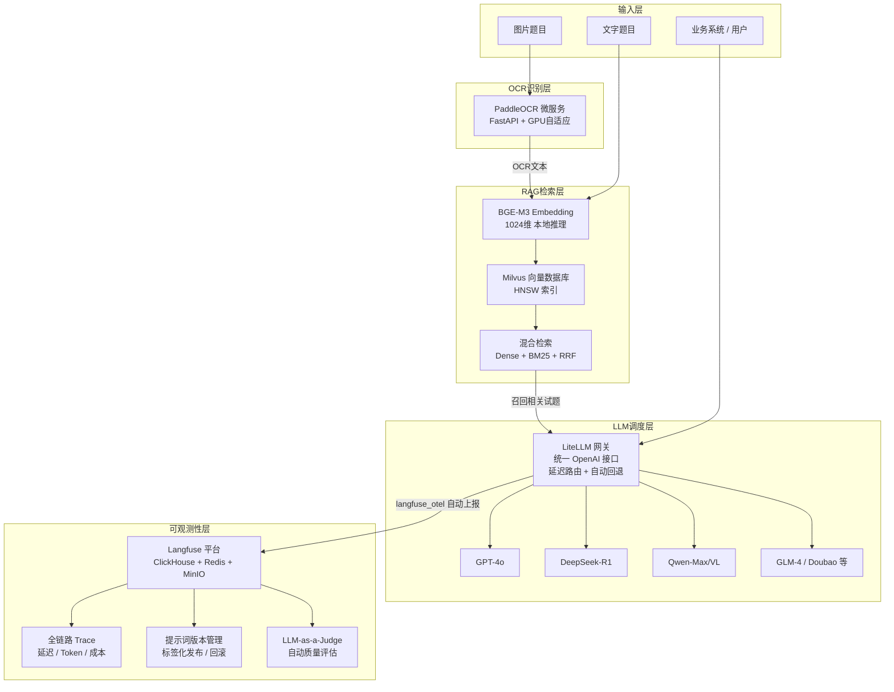

# AI 平台建设——整体架构汇报

> 文档版本：v1.0 | 汇报日期：2026-02-24 | 范围：题库智能检索与 LLM 服务平台

---

## 一、执行摘要

本阶段完成了公司 AI 基础设施的全面工程化建设，覆盖从**图片题目识别**、**语义向量检索**、**多模型统一调度**到**全链路可观测性**的完整技术栈。通过 5 大核心组件的协同落地，将 AI 能力从"各自为战、野蛮生长"升级为"统一管理、可控可观、数据驱动"的工程化体系，为公司 AI 能力的规模化落地打下了坚实基础。

| 核心问题                | 解决方案                   | 交付组件               |
| ------------------- | ---------------------- | ------------------ |
| 多厂商 LLM 碎片化，业务代码强耦合 | 统一 API 网关，兼容 OpenAI 规范 | LiteLLM            |
| 关键字检索失效，图片题目无法处理    | 向量语义检索 + OCR 入库        | Milvus + PaddleOCR |
| RAG 管道繁琐，向量库强耦合     | 统一 RAG 框架，屏蔽底层差异       | LlamaIndex         |
| LLM 调用黑盒，提示词无版本管理   | 全链路可观测性 + 提示词平台        | Langfuse           |

---

## 二、整体架构全貌

### 2.1 系统架构总图

### 2.2 关键数据流说明

| 数据流        | 路径                                | 技术组件                            |
| ---------- | --------------------------------- | ------------------------------- |
| **图片题目入库** | 图片 → OCR识别 → Embedding → Milvus写入 | PaddleOCR → LlamaIndex → Milvus |
| **语义检索**   | 查询文本 → Embedding → 混合检索 → 召回排序    | LlamaIndex → Milvus             |
| **LLM 推理** | 业务请求 → 网关路由 → LLM响应               | LiteLLM                         |
| **可观测上报**  | 每次LLM调用 → 自动采集 → Trace存储          | Langfuse                        |
| **提示词下发**  | UI修改 → 标签发布 → SDK缓存读取             | Langfuse                        |

---

## 三、各组件架构摘要

### 3.1 LiteLLM — 统一 LLM API 网关

> **详细文档**：[01-litellm.md](01-litellm.md)

**定位**：作为全公司大模型访问的统一入口层，对外 100% 兼容 OpenAI API 规范，对内统一路由至 6 家厂商 24 个模型。

**解决的核心问题**：

- 各业务方直连不同厂商 SDK，业务代码强耦合，接入新模型需周级工作量
- 无统一限流与成本管控，月底账单才知道消耗了多少
- 单一模型故障或限流时无降级机制，直接影响业务可用性

**关键技术能力**：

| 能力       | 实现方式                                       | 价值         |
| -------- | ------------------------------------------ | ---------- |
| 统一接口     | 100% OpenAI API 兼容，业务仅需修改 `base_url`       | 零迁移成本接入    |
| 智能路由与高可用 | 延迟优先路由 + 3级回退链 + 60秒冷却机制                   | 模型故障业务无感知  |
| 精细化权限管控  | Master→Team→User 三级 Key 体系，支持 RPM/TPM/预算限额 | 成本可控，权限可审计 |
| 全量审计日志   | 所有请求持久化至 PostgreSQL，Admin UI 可视化           | 合规可溯源      |

**交付状态**：

| 交付项                           | 状态  |
| ----------------------------- | --- |
| Docker Compose 一键部署（网关 + 数据库） | 已验证 |
| 6 家厂商 24 个模型接入（含视觉模型）         | 已验证 |
| 延迟优先路由 + 11 条回退链              | 已验证 |
| 数据库自动备份（保留 30 天）+ 恢复脚本        | 已验证 |

---

### 3.2 Milvus — 企业级向量数据库

> **详细文档**：[02-milvus.md](02-milvus.md)

**定位**：试题语义匹配系统的核心存储与检索引擎，支持百万量级向量数据 10ms 内语义检索。

**解决的核心问题**：

- MySQL 关键字匹配无法处理"语义相近但表述不同"的检索诉求
- 图片题目经 OCR 后无法用关键字方案检索，必须依赖向量语义
- 原型工具 Chroma 不具备生产级稳定性与水平扩展能力

**关键技术能力**：

| 能力          | 实现方式                                           | 价值           |
| ----------- | ---------------------------------------------- | ------------ |
| ANN 语义检索    | HNSW 索引，1024维 BGE-M3 向量                        | 查询延迟稳定 <10ms |
| 向量 + 标量协同过滤 | `subject` 字段标量索引，一次调用完成两种过滤                    | 无需两次查询，无后处理  |
| 原生幂等 Upsert | 有则更新、无则插入，安全重复调用                               | 业务逻辑复杂度大幅降低  |
| 三模式无缝迁移     | Lite（本地）→ Standalone（生产）→ Cluster（扩展），修改一行 URI | 代码零改动，按需扩展   |

**交付状态**：

| 交付项                                            | 状态  |
| ---------------------------------------------- | --- |
| Docker Compose 部署（Milvus Standalone + Attu UI） | 已验证 |
| 数据清洗 → BGE-M3 Embedding → 入库完整管线               | 已验证 |
| 向量检索 + BM25 + RRF 融合排序 + Rerank 链路             | 已验证 |
| 启用动态字段的 Schema 设计                              | 已验证 |

---

### 3.3 LlamaIndex — 企业级 RAG 检索框架

> **详细文档**：[03-llamaindex.md](03-llamaindex.md)

**定位**：在向量数据库与大模型之间建立"正确的抽象层次"，作为整个 RAG 系统的数据层与检索层核心框架。

**解决的核心问题**：

- 数据切分、Embedding 批处理、并发控制、重试逻辑需全部手工实现，代码量庞大
- 直接调用 Milvus SDK 导致业务与存储强耦合，迁移向量库需大规模重构
- 混合检索 Dense + BM25 + RRF 自行实现需深入理解算法细节

**关键技术能力**：

| 能力                | 实现方式                                                    | 价值           |
| ----------------- | ------------------------------------------------------- | ------------ |
| 开箱即用数据管道          | `VectorStoreIndex.from_documents()`，框架托管切分/Embedding/写入 | 手写数百行 → 一行调用 |
| 统一 VectorStore 抽象 | 替换一行实现类即可切换向量库（Milvus/Pinecone/pgvector）                | 彻底避免厂商锁定     |
| 原生混合检索 + RRF      | `vector_store_query_mode="hybrid"`，参数化配置                | 实测召回率提升约 15% |
| 模型与业务解耦           | `Settings` 全局注入，数据不出本地满足合规要求                            | 切换模型修改一个变量   |
| 统一多模态消息模型         | `ChatMessage / TextBlock / ImageBlock` 抽象，厂商无关          | 视觉模型升级无需改代码  |

**交付状态**：

| 交付项                                         | 状态  |
| ------------------------------------------- | --- |
| MySQL → 文档切分 → Embedding → Milvus 批量写入自动化管道 | 已验证 |
| Dense 向量 + BM25 稀疏 + RRF 融合混合检索链路           | 已验证 |
| 图文混合消息构建，通过 LiteLLM 对接千问 VL                 | 已验证 |
| 核心业务代码总量不超过 300 行                           | 已验证 |

---

### 3.4 PaddleOCR — 图像识别微服务

> **详细文档**：[04-paddleocr.md](04-paddleocr.md)

**定位**：整个题库处理链路的图像文字识别基础能力层，负责打通从"图片输入"到"语义检索"的入口。

**解决的核心问题**：

- 试题以图片形式存在时，关键字与向量检索方案均无法直接处理，必须先提取文字

**关键技术能力**：

| 能力             | 实现方式                                   | 价值              |
| -------------- | -------------------------------------- | --------------- |
| 高精度中文 OCR      | PaddleOCR + 倾斜校正（`use_angle_cls=True`） | 准确识别含倾斜的手写/印刷题目 |
| 异步非阻塞推理        | `run_in_threadpool` 投入线程池，主事件循环不阻塞     | 高并发请求不互相阻塞      |
| 线程安全 Reader 缓存 | `threading.local()` 线程级复用，消除模型重复加载开销   | 推理性能大幅提升        |
| 硬件自适应          | 运行时自动探测 CUDA，有 GPU 用 GPU，无则降级 CPU      | 开发机与生产同一套代码     |

**交付状态**：

| 交付项                                   | 状态  |
| ------------------------------------- | --- |
| 图片 OCR 接口（`POST /ocr/image`），支持 5 种格式 | 已验证 |
| GPU / CPU 自动适配                        | 已验证 |
| 线程安全 Reader 缓存                        | 已验证 |
| 健康检查接口（`GET /health`）                 | 已验证 |
| 核心代码量约 160 行                          | 已验证 |

---

### 3.5 Langfuse — LLM 全链路可观测性平台

> **详细文档**：[05-langfuse.md](05-langfuse.md)

**定位**：为整个 AI 工程体系补齐"提示词管理"、"可观测性"、"质量评估"三大核心能力，让 LLM 应用从"凭感觉运营"升级为"有数据、可度量、能迭代"。

**解决的核心问题**：

- 提示词硬编码在代码中，每次迭代必须走工程发布流程，产品与算法无法独立操作
- LLM 调用如黑盒，出现质量问题难以定位，Token 成本无法精细化统计
- A/B 效果对比依赖人工经验，缺乏系统化实验与数据驱动的迭代手段

**关键技术能力**：

| 能力             | 实现方式                                            | 价值            |
| -------------- | ----------------------------------------------- | ------------- |
| 提示词版本化管理       | Web UI 修改 → `production` 标签发布，SDK 客户端缓存         | 分钟级生效，无需代码发布  |
| 零侵入全链路 Trace   | `langfuse_otel` 回调，LiteLLM 一次配置全量覆盖             | 业务代码零改动       |
| 高性能分层存储        | ClickHouse（亿级 Trace 秒级聚合）+ Redis 削峰 + MinIO 持久化 | 写入低延迟，分析高性能   |
| LLM-as-a-Judge | 配置评判规则后对生产 Trace 自动评分                           | 质量评估无需人工逐条审阅  |
| 完全自托管          | Docker Compose 单机完整运行，数据不出本地                    | 数据主权完整，满足合规要求 |

**交付状态**：

| 交付项                                                             | 状态  |
| --------------------------------------------------------------- | --- |
| Docker Compose 一键部署（Langfuse + PG + ClickHouse + Redis + MinIO） | 已验证 |
| `langfuse_otel` 与 LiteLLM 集成，所有 LLM 调用自动上报                      | 待验证 |
| Playground 配置（通过 LiteLLM 在线调试验证）                                | 已验证 |
| 提示词版本控制 + 标签化发布流程验证                                             | 已验证 |
| 完整健康检查与自动重启策略                                                   | 已验证 |

---

## 四、整体交付成果汇总

| 组件                 | 部署形态                       | 核心交付内容                                           | 状态   |
| ------------------ | -------------------------- | ------------------------------------------------ | ---- |
| **LiteLLM 网关**     | Docker Compose             | 6厂商24模型统一接入 + 延迟路由 + 三级Key体系 + 审计日志              | 已验证  |
| **Milvus 向量库**     | Docker Compose（Standalone） | 混合检索完整链路 + Schema设计 + 数据迁移脚本                     | 已验证  |
| **LlamaIndex RAG** | Python 服务                  | 数据录入管道 + 混合检索 + 多模态对话 + 扩展接口预留                   | 已验证  |
| **PaddleOCR 微服务**  | FastAPI 服务                 | 图片OCR接口 + GPU自适应 + 线程安全缓存 + 健康检查                 | 已验证  |
| **Langfuse 平台**    | Docker Compose             | 全链路Trace + 提示词版本管理 + LLM-as-a-Judge + Playground | 正在验证 |

**基础设施汇总**：

- 全部组件均通过 **Docker Compose 一键部署**，无复杂运维依赖
- 数据持久化：PostgreSQL（LiteLLM + Langfuse 配置）、ClickHouse（Trace 分析）、MinIO（事件存储）、Milvus（向量数据）
- 自动化运维：数据库备份保留 30 天、服务异常自动重启、健康检查全覆盖

---

## 五、价值收益总结

### 5.1 改造前后对比

| 维度          | 改造前                        | 改造后                                       |
| ----------- | -------------------------- | ----------------------------------------- |
| **模型接入成本**  | 各业务方各自对接厂商 SDK，周级工作量       | 网关配置追加，分钟级完成；业务代码零改动                      |
| **服务可用性**   | 单点依赖厂商，故障即中断业务             | 3级自动回退 + 冷却机制，业务无感知                       |
| **成本与权限管控** | API Key 裸露散落，月底账单才知消耗      | 三级 Key 体系 + 预算上限，实时按团队可视                  |
| **题目语义检索**  | 关键字精确匹配，表述不同即漏检；图片题目完全无法处理 | 向量语义检索 + 混合排序，图片与文字题目同等支持，<10ms 响应        |
| **AI 质量评估** | 依赖人工经验，无量化依据；提示词改动必须走发布流程  | LLM-as-a-Judge 自动评分 + A/B 实验；Web UI 分钟级发布 |
| **可观测性**    | LLM 调用黑盒，问题难定位，无完整上下文      | 全链路 Trace，端到端可视化还原，P50/P95/P99 延迟全覆盖      |
| **数据安全合规**  | 云端 Embedding API 存在数据外泄风险  | BGE-M3 本地推理，所有 Trace 数据自托管，数据不出本地         |

### 5.2 技术债务与扩展路径

| 当前状态                   | 未来扩展路径                             | 改动成本              |
| ---------------------- | ---------------------------------- | ----------------- |
| Milvus Standalone 单机部署 | 升级至 Milvus Cluster 分布式，支持 PB 级数据   | 修改 URI 参数，业务代码零改动 |
| 本地 BGE-M3 Embedding    | 切换至 `text-embedding-3-large` 等云端模型 | 修改一个环境变量          |
| LlamaIndex 检索链路        | 接入 Reranker / HyDE / Agent 增强检索    | 扩展接口已预留           |
| Langfuse 单机部署          | 迁移至 Kubernetes，官方 Helm Chart 就绪    | 平滑迁移，无需重构         |

### 5.3 整体总结

> 本阶段 AI 平台建设通过 **LiteLLM（统一调度）+ Milvus（语义存储）+ LlamaIndex（RAG框架）+ PaddleOCR（图像识别）+ Langfuse（可观测性）** 五大组件的协同落地，构建了一套从"图片/文字题目输入"到"语义检索增强生成"再到"全链路质量监控"的完整 AI 工程体系。整体架构具备低耦合、可扩展、数据安全自托管三大特性，为后续 AI 能力的持续迭代与规模化业务落地提供了坚实的基础设施。

