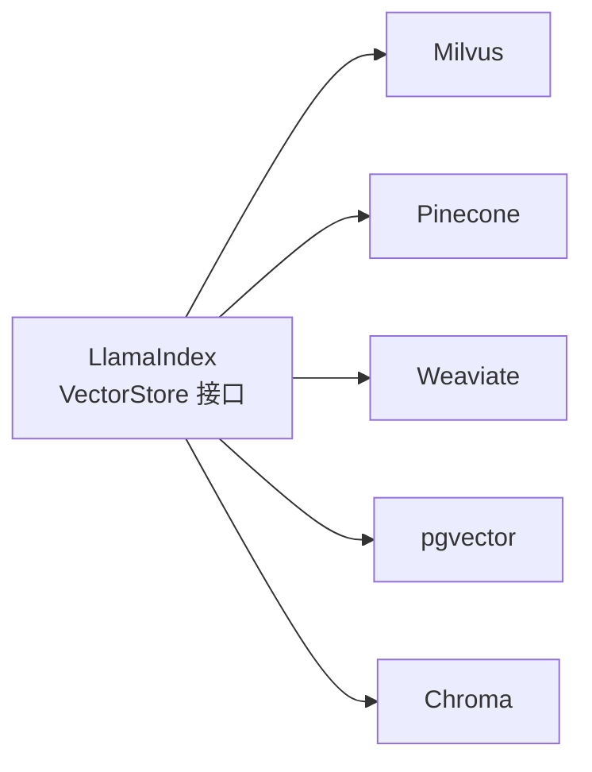

# LlamaIndex 功能优势汇报

> 视角：架构师工作汇报
> 项目：LlamaIndex BGE-M3 题库检索系统

---

## 一、框架定位

LlamaIndex 是专为 **LLM 应用数据层** 设计的开源框架，核心价值在于解决"如何高效地把企业私有数据喂给大模型"这一工程难题。

与 LangChain 偏向 Agent/工具链编排不同，LlamaIndex 更专注于**数据摄取、索引构建、检索优化**三个核心环节，是构建生产级 RAG 系统的首选基础框架。

---

## 二、在本项目中发挥的核心优势

### 2.1 开箱即用的数据管道抽象

本项目从 MySQL 读取结构化 JSON 数据，只需调用 `VectorStoreIndex.from_documents()`，LlamaIndex 自动完成：

- 文档切分（`SentenceSplitter`，支持 `chunk_size` / `chunk_overlap` 配置）
- 批量 Embedding 调用（`embed_batch_size=4`，适配本地 GPU 显存限制）
- 向量批量写入外部存储（`insert_batch_size=64`）

这一层抽象节省了大量底层 IO、并发控制与重试逻辑代码。

```python
# src/ingest.py - 核心录入逻辑仅需以下调用
index = VectorStoreIndex.from_documents(
    documents,
    storage_context=storage_context,
    show_progress=True,
    insert_batch_size=64,
)
```

---

### 2.2 向量存储的统一接口

LlamaIndex 通过 `VectorStore` 抽象层屏蔽了不同向量数据库的 API 差异：



本项目当前使用 Milvus。如果未来需要迁移向量库，**只需替换 `VectorStore` 实现，上层检索逻辑零改动**。这是 LlamaIndex 最重要的架构价值之一，彻底避免了厂商锁定。

---

### 2.3 原生支持 Hybrid 混合检索 + RRF 融合

LlamaIndex 对 Milvus 的 Hybrid 检索（Dense 语义向量 + BM25 稀疏关键词 + RRF 重排）提供了一等公民支持。

若自行实现同等能力，需手动管理双路向量写入、RRF 公式计算（`1/(k + rank)`）、结果合并排序等大量代码。借助 LlamaIndex，核心配置仅需：

```python
# src/ingest.py - Hybrid 录入配置
vector_store = create_milvus_vector_store(
    enable_sparse=True,
    sparse_embedding_function=BM25BuiltInFunction(),
    hybrid_ranker="RRFRanker",
    hybrid_ranker_params={"k": HYBRID_RRF_K},
)

# src/query.py - Hybrid 检索调用
retriever = index.as_retriever(
    similarity_top_k=top_k,
    vector_store_query_mode="hybrid",
)
```

**效果**：语义检索（BGE-M3 Dense）捕捉语义相似度，BM25 稀疏检索补充关键词精确匹配，RRF 融合排序兼顾两路结果，整体召回率和精准度显著优于单路检索。

---

### 2.4 Embedding 模型与 LLM 的解耦设计

通过全局 `Settings` 对象统一注入模型依赖，将模型选型与业务逻辑彻底解耦：

```python
# src/ingest.py / src/query.py - 模型注入，一处配置全局生效
Settings.embed_model = HuggingFaceEmbedding(
    model_name=EMBED_MODEL,       # 当前：BAAI/bge-m3
    embed_batch_size=EMBED_BATCH_SIZE,
)
```

本项目选用本地 BGE-M3 而非 OpenAI API，**数据不出本地，满足数据安全要求**。未来若需切换为其他 Embedding 模型（如 `text-embedding-3-large`、`bge-large-zh`），只需修改 `EMBED_MODEL` 环境变量，业务代码无需任何改动。

---

### 2.5 多模态扩展能力

LlamaIndex 提供了统一的多模态消息模型（`ChatMessage` / `TextBlock` / `ImageBlock`），屏蔽了不同视觉大模型（Qwen-VL、GPT-4V、Claude Vision 等）的 API 差异。

本项目在 `openai_vision_chat.py` 中利用此能力，通过 LiteLLM 代理对接千问 VL 视觉模型：

```python
# src/openai_vision_chat.py - 图文混合消息构建
blocks = [TextBlock(text=prompt_text)]
if image_bytes is not None:
    blocks.append(ImageBlock(image=image_bytes, image_mimetype=image_mimetype))

response = llm.chat([ChatMessage(role=MessageRole.USER, blocks=blocks)])
```

未来可直接升级为 GPT-4V 或其他视觉模型，消息构建逻辑无需变动。

---

## 三、与纯手工方案的对比

| 能力项 | 纯手工实现 | LlamaIndex |
|---|---|---|
| 文档切分 + Embedding 批处理 | 需自行实现队列、限速、重试逻辑 | 内置，一行配置 |
| 向量库适配 | 针对每个库写专用适配代码 | 统一 VectorStore 接口，可随时切换 |
| Hybrid 检索 + RRF 融合 | 需理解并手写 RRF 公式与结果合并 | 内置支持，参数化配置 |
| 模型切换 | 改动散落在各业务代码中 | `Settings` 全局注入，一处修改 |
| 多模态消息封装 | 需理解并适配各模型 API 差异 | 统一 `ChatMessage/ImageBlock` 抽象 |
| 检索器/查询引擎管道 | 手写中间件调用链 | 声明式 Pipeline 组合 |
| 进度显示与日志 | 需自行实现 | `show_progress=True` 开箱即用 |

---

## 四、架构师视角：未来扩展方向

本项目当前实现了 RAG 系统的核心链路，LlamaIndex 的架构设计为以下方向预留了扩展空间：

### 4.1 切换向量库

替换 `MilvusVectorStore` 为 `PineconeVectorStore` 或 `PGVectorStore`，上层检索与录入逻辑**零改动**。适用于云端部署或 PostgreSQL 统一存储的场景。

### 4.2 升级检索策略

在现有 Hybrid 检索基础上，可通过 LlamaIndex Pipeline 叠加：
- **Reranker**（如 `BGERerank`、`CohereRerank`）：对 top-k 结果二次精排
- **HyDE**（Hypothetical Document Embeddings）：先让 LLM 生成假设答案再检索，提升语义对齐度
- **多路召回融合**：不同索引结果合并后统一重排

### 4.3 引入 Agent 能力

基于现有 `QueryEngine` 构建 `ReActAgent`，实现：
- 多轮对话上下文管理
- 工具调用（查 MySQL、调视觉模型、检索向量库）自动编排
- 复杂教学场景的问答推理

### 4.4 多租户隔离

利用 Milvus 元数据过滤（`subject_key`、`paper_id`），扩展为按学科/年级/试卷隔离的独立检索服务，无需多个 Collection，通过过滤条件即可实现逻辑隔离。

```python
# 示例：按学科过滤检索（未来扩展方向）
retriever = index.as_retriever(
    similarity_top_k=top_k,
    vector_store_query_mode="hybrid",
    filters=MetadataFilters(filters=[
        MetadataFilter(key="subject_key", value="math")
    ]),
)
```

---

## 五、总结

LlamaIndex 带来的核心价值是**"正确的抽象层次"**。

它不试图替代向量数据库（Milvus 依然发挥其分布式检索能力），也不试图替代 LLM，而是在数据与模型之间提供了一套**稳定、可扩展的粘合层**。

本项目当前规模下，LlamaIndex 使得整个系统的核心逻辑（数据清洗 + 录入 + 检索 + 多模态对话）用**不到 300 行业务代码**完整实现，且在架构上保持了高度的灵活性与可维护性。
